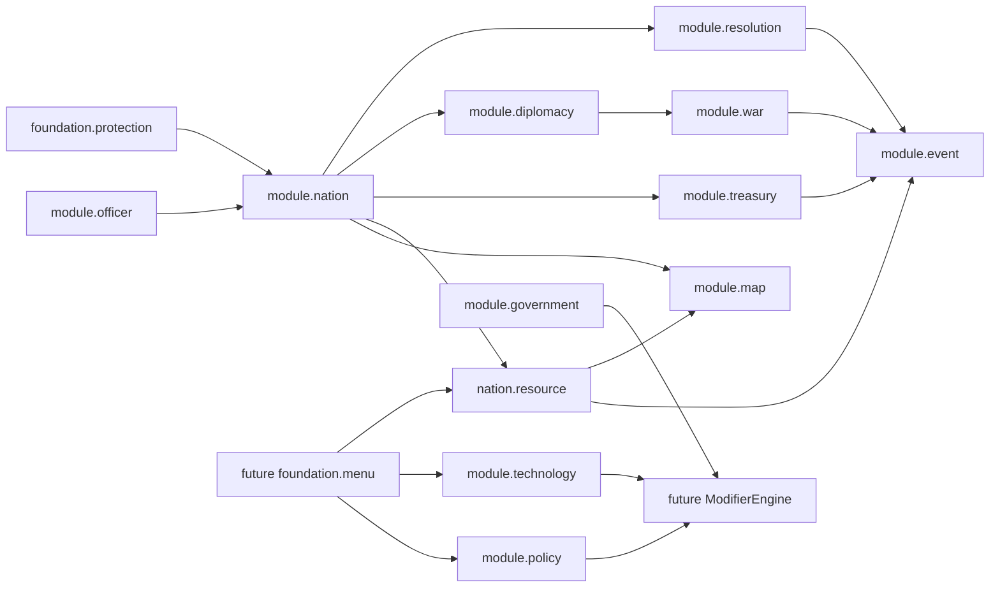

# STARCORE Module Plan

## 当前使用方式

- 模块分波次看这里
- 当前真实进度、验证状态、续跑顺序，看 `CONTINUATION_PLAN_2026-06-05.md`
- HUD / web map 前端契约看 `MAP_HUD_REFACTOR_2026-06-06.md`
- 外部参考和 V0.1 -> V1 技术路线看 `OPEN_SOURCE_REFERENCE_ROADMAP_2026-06-03.md`

这份文档现在同时承担“功能规划主表”的职责：每次新增功能前，先确认它属于哪个功能包、依赖哪些已有底座、验收信号是什么。不要只按模块名堆代码。

## 当前规划原则

- 先统一契约，再扩功能：尤其是 web map 三份资产 `src/main/resources/web/map`、`map/`、`test-server-paper-1.21.11/plugins/map/` 必须先对齐。
- 所有可见按钮都必须对应真实功能、真实跳转或明确禁用/空状态，不能把装饰性按钮当产品完成。
- 中文优先，英文可切换；玩家侧、管理员侧、发布文案都不能出现半截未汉化的关键操作。
- 游戏内命令、信标 GUI、网页地图、悬浮显示、Browser smoke 的状态文案要尽量共用同一套后端展示支持，避免多端漂移。
- 默认保持 STARCORE 独立，不硬依赖 Towny / Vault / LuckPerms / WorldGuard / WorldEdit / Lands / WorldDynamics；外部集成走可选 adapter。
- 新功能必须能进入验证链：至少有单测或脚本断言；用户可见功能要有 Browser/Paper smoke 证据。

## Wave 1: kernel + core strategic modules
- core.kernel
- foundation.player
- foundation.message
- foundation.territory
- module.nation
- module.government
- module.resolution
- module.treasury
- module.diplomacy
- module.policy

## Wave 2: advanced strategic simulation
- module.war
- module.technology
- module.resource
- module.officer
- module.event

## Wave 3: productized operation surfaces

- module.map web HUD
- module.nation operation dashboard
- module.resource district command/intel surface
- foundation.menu
- release/operations scripts

目标：把已经跑通的国家、圈地、资源区块、财政、决议等底座做成可运营的产品面，而不是只停留在命令/API 层。

## Wave 4: extensibility and scale

- public Java API
- optional external protection adapters
- optional placeholders / server ecosystem adapters
- SQL repository split
- performance budgets and profiling
- CI/release matrix

目标：让 STARCORE 能被大型服务器长期维护、扩展和发布，同时保持核心独立。

## Architectural Rules
- Modules declare metadata, layer, dependencies, and provided services.
- Domain entities are persistence-agnostic.
- Services own orchestration and event publication.
- Repositories own data access.
- Foundation services remain reusable and do not depend on business modules.
- Platform-specific code remains behind adapters.

## 功能规划总览

| 优先级 | 功能包 | 用户价值 | 当前底座 | 下一步 | 验收信号 |
|---|---|---|---|---|---|
| P0 | Web map HUD 契约统一 | 玩家和管理员看到同一套地图行为，不再被预览壳/runtime 漂移误导 | 已选择 intel-only 资源区块 HUD 契约；三份 map 资产扫描 `matches=0`；Browser smoke 输出 `commandUiRemoved=true`；release verify 已接入 HUD contract gate | 继续保持三份资产同步；若未来恢复 web 指挥面，必须同改资产、Browser smoke 和 contract gate | `check-map-hud-contract.ps1` PASS；Browser smoke PASS 字段命名清楚；三份 `map.js` 可继续做语法门禁 |
| P1 | 国家领袖运营面 | 领袖能快速知道国家当前最该处理什么 | 国家详情、优先队列、运营概览、时间线、最近日志、完整事件日志和官员授权矩阵已落地；授权矩阵现在还会显示当前访问者逐项是否可操作及原因；完整事件日志已支持搜索、actor/reason 双路径上下文 chip、跨事件跳转定位、只读 facts 分组、CSV/JSON 导出和移动端窄屏截图基线；完整事件日志移动端基线已覆盖财政、战争、官员、外交、策略、领地、国家七类事件族；资源类事件日志已联动资源 explanation、资源迁移授权和运营处理组入口；财政、战争、官员、外交、策略、领地、国家事件日志已接入运营联动卡和同类处理入口；资源区块 `CommandState` 已输出 typed explanation，并已渲染进 Browser DOM，多状态 Browser fixture 和运行服真实数据造景都已覆盖 `ready/awaiting-target/waiting-depletion/insufficient-balance/player-offline`；`nation.operations.feedback`、`nation.strategy.feedback`、`nation.diplomacy.feedback`、`nation.officers.feedback`、`nation.treasury.feedback` 已覆盖国家操作、策略、外交、官员、国库高价值命令；Paper smoke 已覆盖 `nationOperationFeedback`、`strategyFeedback` 与 `governanceFeedback` | 继续补真实命令来源事件和发布证据，形成完整运营闭环 | 国家详情面可渲染、可筛选、可定位、可选中资源区块；资源区块阻塞原因在 metadata/API/命令/Browser DOM 可读；Browser smoke 输出 `officerAuth=marshal+treasurer+diplomat+steward:9`、`officerAccess=founder:9`、`resourceExplanation=<state>:<count>`、`resourceExplanationFixture=ready+awaiting-target+waiting-depletion+insufficient-balance+player-offline:5`、`resourceExplanationRuntime=ready+awaiting-target+waiting-depletion+insufficient-balance+player-offline:5`、`recentLogFilter=<category>:<count>`、`eventQuery=<filter>:<count>`、`eventLedger=<filter>:<count>`、`eventOps=resource+explanation+auth+group:<count>`、`eventOpsFamilies=finance+war+officer+diplomacy+strategy+territory+nation:7`、`eventSearch=<encodedQuery>:<count>`、`eventContext=<field>-<value>:<count>`、`eventReason=reason-<value>:<count>`、`eventJump=reason-<value>:<count>`、`eventMobile=390x844:<count>`、`eventFamilies=finance+war+officer+diplomacy+strategy+territory+nation:7`、`eventFamilyMobile=finance+war+officer+diplomacy+strategy+territory+nation:7`、`eventFacts=amount+balance:<count>`、`eventLedgerExport=csv+json` 和 `commandUiRemoved=true`；国家操作、策略和治理 feedback marker 通过 |
| P1 | 资源区块管理闭环 | 领袖能理解资源区块收益、限制、迁移状态和下一步 | `NationResourceDistrict*Support`、命令、GUI、悬浮显示、地图 metadata、`foundation.feedback` 通用 profile 已有；`NationResourceDistrictCommandSupport.explanation(...)` 已覆盖 ready、等待选点、等待枯竭、余额不足、需领袖、需在线、非本国、区块缺失；网页 POST、marker metadata 和 Browser DOM 已输出 typed explanation；Browser smoke 的多状态 fixture 已用生产 renderer 锁住 `ready/awaiting-target/waiting-depletion/insufficient-balance/player-offline` 和 success/info/error severity 样式；Paper/Browser smoke 已用真实运行服 snapshot 锁住同五种 explanation 状态；`/starcore resource migrate` 失败会打印同源 reasons；Paper smoke 已覆盖 `gui+mined+forced+feedbackSound:5+worldSound:7+particles:7+actionbar:3+title:2+bossbar:4+bossbarHide:4` 迁移与游戏内效果路径 | 继续和官员权限、事件日志筛选联动，并把真实运行服证据纳入发版包 | `NationResourceDistrictCommandSupportTest`、`NationResourceDistrictMenuSupportTest`、View/Operational tests、Map endpoint/metadata tests、通用 feedback 单测、Paper smoke 的 GUI 文本、迁移路径、玩家侧声音/actionbar/title/BossBar 和 World 侧粒子/声音证据通过；Browser smoke 锁住 `resourceExplanation=<state>:<count>`、`resourceExplanationFixture=ready+awaiting-target+waiting-depletion+insufficient-balance+player-offline:5` 与 `resourceExplanationRuntime=ready+awaiting-target+waiting-depletion+insufficient-balance+player-offline:5` |
| P1 | 圈地体验与价格解释 | 玩家知道为什么贵、哪里冲突、怎么确认 | in-game claim tool 与 web claim 共用 preview/commit；价格明细已有；`ClaimSelectionPreview` 已携带 `ClaimSelectionExplanation` / `ClaimSelectionReason`，覆盖余额、容量、重叠、外部保护冲突和价格驱动；`WebClaimConfirmationResult` 已携带 `status` 与 `ClaimSelectionExplanation`，覆盖 pending 找不到、非本人、过期、状态变化、提交失败和主动取消；资源区块迁移也已接入同形状 explanation；`nation.claims.feedback` 已覆盖当前区块圈地、工具确认/取消/失败、web pending、`/starcore map confirm` 成功/失败和 `/starcore map cancel` 取消；Paper smoke 已覆盖 `claimExplanation=externalProtection:1`、`webClaimFeedback=confirmSound:1+confirmActionbar:1+confirmBossbar:1` 与在线 pending/cancel feedback | 继续把 Browser DOM 的 confirm/cancel 状态展示做深；后续可抽更通用的 operation explanation 包名 | Web claim smoke、`/starcore map confirm` 和 `/starcore map cancel` 通过；claim explanation marker 通过；资源区块 explanation JUnit 通过；claim feedback marker 通过；价格/冲突/容量/pending 状态 DOM 或命令输出可读 |
| P2 | 政策 / 科技 / ModifierEngine | 国家策略不再是单一开关，而是可组合的长期发展 | `PolicyService`、`TechnologyService`、政策效果查询已存在；政策激活、科技解锁和战争宣告已走 `nation.strategy.feedback`，Paper smoke 已锁住 `strategyFeedback` 计数 | 抽共享 modifier、配置化政策/科技定义、补树状 GUI 原型 | policy/tech 单测覆盖 prerequisites/effects；策略 feedback marker 通过；MenuType 原型能只读展示 |
| P2 | 国策 / 社交 / 社会模拟 | 国家不只是领地和资源，而有民意、派系、稳定度和玩家关系 | policy、government、officer、event、resolution、diplomacy 已有骨架 | 增加社会指标 state、玩家声望/派系、国策社会效果、事件链反馈 | 社会指标可持久化；政策能改变社会指标；命令/GUI/Web 能解释变化原因 |
| P2 | 财政 / 资源 / 经济账本 | 服务器能追踪资金和资源变化原因 | `TreasuryService`、`ResourceService`、SQL 状态、命令/网页查账、导出、管理员指南已存在；国库存入、支出、奖励、日常收入和税收结算已走 `nation.treasury.feedback`，并由 `nation.treasury.feedback.minimum-amount` 限制可见反馈 | 继续做可配置账本分类和真实 smoke 验证；把国库流水和 web/命令筛选说明继续对齐 | SQL 表计数进入 smoke；命令/网页能按类型和时间查账并导出；治理 feedback marker 覆盖 treasury |
| P2 | 外交 / 决议 / 战争联动 | 战争和外交从状态开关变成可追溯的政治流程 | `DiplomacyService`、`ResolutionService`、`WarService`、event log 已存在；外交关系设置和提议已走 `nation.diplomacy.feedback`，Paper smoke 覆盖 diplomacy marker | 战争宣告接入决议/事件/财政成本；外交关系变更继续进入最近日志和 web 可解释状态 | deep smoke 包含 relation -> resolution/event -> war marker；治理 feedback marker 覆盖 diplomacy |
| P2 | 官员 / 事件 / 最近日志 | 管理团队能分工，玩家能看懂国家历史 | `OfficerService`、`EventService`、最近日志 DOM 已存在；最近日志 metadata 已输出 `recentEvent{n}Category`，并用多分类摘要避免高频资源事件刷屏；web 最近日志可按资源/财政/官员/外交/战争/策略/领地/国家/其他分类筛选；后端 `/api/map/events` 已支持按国家、分类、类型、资源区块、时间窗口、`query`、`actor`、`reason` 分页查询；国家详情完整事件日志 UI 支持分类、时间范围、当前资源区块、分页、搜索、actor/reason chip、跨事件跳转、只读 facts 分组、CSV/JSON 导出和 390x844 移动端截图基线；资源类事件日志已能显示 typed resource explanation、资源迁移授权和处理同类问题入口；财政、战争、官员、外交、策略、领地、国家事件日志已能显示运营联动卡、授权/命令边界和同类追踪入口；事件接口契约样例已覆盖政策、科技、外交、战争和财政 actor/reason/facts 组合；Browser/Paper smoke 已覆盖财政、战争、官员、外交、策略、领地、国家七类真实上下文事件族和移动端窄屏基线；资源迁移、国库、外交、战争、政策、科技官员授权已配置化并暴露到 Web 国家详情授权矩阵；矩阵已显示当前访问者 `founder/officer/needs-appointment/external-nation` 等状态；官员任命/移除已走 `nation.officers.feedback`，Paper smoke 覆盖 officer marker | 继续补真实命令来源事件和发布证据 | 命令和 web 最近日志都能按类型展示；Browser smoke 覆盖官员授权矩阵并输出 `officerAuth=marshal+treasurer+diplomat+steward:9` 和 `officerAccess=founder:9`；Browser smoke 覆盖最近日志分类筛选并输出 `recentLogFilter=<category>:<count>`，真实请求事件查询接口并输出 `eventQuery=<filter>:<count>`，真实点击深日志 DOM 并输出 `eventLedger=<filter>:<count>`、`eventOps=resource+explanation+auth+group:<count>`、`eventOpsFamilies=finance+war+officer+diplomacy+strategy+territory+nation:7`、`eventSearch=<encodedQuery>:<count>`、`eventContext=<field>-<value>:<count>`、`eventReason=reason-<value>:<count>`、`eventJump=reason-<value>:<count>`、`eventMobile=390x844:<count>`、`eventFamilies=finance+war+officer+diplomacy+strategy+territory+nation:7`、`eventFamilyMobile=finance+war+officer+diplomacy+strategy+territory+nation:7`、`eventFacts=amount+balance:<count>`，真实点击导出按钮并输出 `eventLedgerExport=csv+json`；治理 feedback marker 覆盖 officer |
| P3 | 外部保护桥扩展 | 与更多保护插件共存，不破坏 STARCORE 核心 | ProtectorAPI bridge、ServiceLoader、Guarded service 已存在 | 增加 adapter 规范文档；按需接第二个桥 | 单桥故障隔离测试通过；`/starcore status` 汇总多桥 |
| P3 | 运维 / 发布 / 证据包 | 发版可复现，回滚有证据 | verify/release/evidence/selfcheck 脚本已存在；HUD contract check、performance budget + median trend + method-level runtime + dedicated batch samples、Spark profile summary 入口已纳入 `verify-starcore-release.ps1`、`LATEST_VERIFICATION_SUMMARY.md`、release evidence pack 和 release channel assets；统一验证入口已新增 `-RequireRealSparkProfile`，正式打包可拒绝 sample/manual profiling | 导入真实运行服 spark profile 后，跑一次带 `-RequireRealSparkProfile` 的完整一站式 zip 发版验证 | release checklist 全绿；证据包和发布渠道包包含 jar、summary、browser artifact、HUD contract summary、performance budget summary、真实 Spark profile summary；预算和 median trend 进入摘要 |
| P3 | 性能 / 缓存 / 空间索引 | 大服下 claim、地图、SQL 写入不拖 TPS | SQL 默认、异步保存、smoke 表计数已有；claim lookup、map render、SQL flush、browser snapshot 第一版预算门禁、最近 5 次 median trend、方法级 runtime 预算、dedicated batch samples、Spark profile 导入入口和真实 profile 发版门禁已有 | 用真实服 spark profiling 替换 `sample-verification`；评估 Caffeine/JTS；后续按真实服 profiling 再拆更细冷热缓存预算 | spark 报告或脚本预算进入 release summary，趋势异常能被发版前发现；正式 zip 发版不能误用 sample/manual Spark summary |

## 里程碑规划

### M0 - 契约收口

范围：
- Web map HUD 三份资产契约。
- Browser smoke PASS 字段命名。
- `LATEST_VERIFICATION_SUMMARY.md` 和 release checklist 的一致性。

完成条件：
- `src/main/resources/web/map`、`map/`、`test-server-paper-1.21.11/plugins/map` 对 resource-command 的保留/移除结果一致。
- Browser smoke 不再用旧字段误导当前契约。
- 文档不再同时声称“已移除”和“已恢复”同一 UI 面。

### M1 - 运营 UI 可用

范围：
- 国家领袖运营面。
- 资源区块优先队列、操作焦点、运营时间线。
- 资源区块 GUI / 命令 / web / 悬浮显示文案统一。

完成条件：
- 国家详情面所有可见按钮都能被 Browser smoke 点击或明确禁用。
- 资源区块状态在命令、GUI、web、悬浮显示中语义一致。
- 移动端抽屉不会遮蔽整个地图，点选后能回到地图上下文。

### M2 - 策略系统加厚

范围：
- 政策 / 科技 / 政府 / 外交 / 战争 / 资源的 modifier 化。
- 财政和资源账本。
- 决议、外交、战争事件链。

完成条件：
- 新增策略效果能通过统一查询接口被多个模块消费。
- 战争或外交变化能写入事件、影响展示，并进入 smoke marker。
- 财政/资源变化能解释来源，而不是只改数字。

### M3 - 扩展和发布级稳定

范围：
- 外部保护桥 adapter 规范。
- public Java API。
- 性能预算、profiling、CI/release matrix。

完成条件：
- 新 adapter 可通过 `ServiceLoader` 接入，不改核心圈地主链。
- release evidence pack 能说明本次 HUD 契约、smoke 结果、性能/缺测项。
- 大服风险点有预算或 profiling 入口。

## 跨模块依赖图



使用这张图时的规则：
- 从左到右看依赖，避免下游 UI 反向修改领域状态。
- Web map 只消费 map snapshot 和领域 view model；不要把业务判断只写在前端。
- GUI/menu 只渲染 view state 和触发 service action；不要直接改 domain entity。
- Event 是跨模块审计层，不要把事件日志当业务状态源。

## 每轮功能交付模板

新增或扩展功能时，先按下面格式补到本文件或主看板：

```text
功能包:
用户故事:
涉及模块:
已有底座:
新增/修改入口:
前端/命令/GUI 可见面:
禁用/失败/空状态:
验证:
发布证据:
不做范围:
```

最低要求：
- `涉及模块` 要写服务名或文件夹名，不只写概念。
- `前端/命令/GUI 可见面` 要列出每个按钮或命令入口。
- `禁用/失败/空状态` 要先规划，避免按钮可见但不可用。
- `验证` 至少写单测、Paper smoke、Browser smoke、脚本检查中的一种。
- `不做范围` 要明确，防止一次功能切片膨胀到不可验证。

## 按用户角色拆分的功能面

| 角色 | 主要入口 | 现在能做 | 下一步要补 | 验收 |
|---|---|---|---|---|
| 普通玩家 | `/sc n t`、web claim、地图查看 | 圈地预览、提交 pending、回服确认/取消、查看访问者信息；命令和 web 已共用圈地结构化解释；pending 找不到、非本人、过期、状态变化和取消都有 typed explanation | 把 Browser DOM 的 confirm/cancel 状态展示做深 | Web claim + command confirm/cancel smoke；`claimExplanation=externalProtection:1` marker；`onlineWebClaim` cancel marker |
| 国家领袖 | 国家详情、资源区块列表、信标 GUI、`/sc rsc` | 查看资源区块、迁移状态、收益预估、资源区块 GUI 迁移；资源区块迁移阻塞原因已在 API/metadata/命令输出 typed explanation，并已在 Browser DOM 渲染；多状态 explanation 已覆盖生产 renderer fixture 和运行服真实 snapshot；最近操作日志已可按运营分类筛选，完整事件日志 UI 可查 5 条摘要之外的完整事件流，并支持当前资源区块筛选、时间范围、分页、搜索、上下文 chip、跨事件跳转、CSV/JSON 导出和移动端窄屏截图；资源事件日志已可显示 explanation、授权和处理同类问题入口；财政、战争、官员、外交、策略、领地、国家事件日志已可显示运营联动卡和同类追踪入口；官员授权矩阵会显示当前访问者逐项可操作状态 | 继续补真实命令来源事件和发布证据 | Browser smoke + GUI Paper smoke；`officerAccess=founder:9` marker；`resourceExplanation=<state>:<count>` marker；`resourceExplanationRuntime=ready+awaiting-target+waiting-depletion+insufficient-balance+player-offline:5` marker；`recentLogFilter=<category>:<count>` marker；`eventQuery=<filter>:<count>` marker；`eventLedger=<filter>:<count>` marker；`eventOps=resource+explanation+auth+group:<count>` marker；`eventOpsFamilies=finance+war+officer+diplomacy+strategy+territory+nation:7` marker；`eventSearch=<encodedQuery>:<count>` marker；`eventContext=<field>-<value>:<count>` marker；`eventReason=reason-<value>:<count>` marker；`eventJump=reason-<value>:<count>` marker；`eventMobile=390x844:<count>` marker；`eventLedgerExport=csv+json` marker；资源区块 explanation JUnit |
| 官员/管理层 | `/sc off`、国家日志、事件流 | 任命官员、记录事件、最近日志显示；web 最近日志已按资源/财政/官员/外交/战争/策略/领地/国家/其他分类筛选；`/api/map/events` 已能按分类、类型、资源区块、时间窗口、`query/actor/reason` 分页查询；完整事件日志 UI 已能在国家详情内分页展示、按当前资源区块深查、搜索上下文、点击 actor/reason chip、横跳完整事件集、导出 CSV/JSON，并已在 390x844 移动截图里证明控件密度可用；资源事件日志已联动资源 explanation、资源迁移授权和运营处理组入口；财政/战争/官员/外交/策略/领地/国家事件日志已联动运营卡、授权边界和同类追踪入口；财政/战争/官员/外交/策略/领地/国家七类真实上下文事件族已进入 Browser/Paper smoke；官员任免已接入 `nation.officers.feedback`；Web 授权矩阵会显示访问者是领袖、命中官职还是缺少任命 | 继续补真实命令来源事件和发布证据 | officer/event 单测 + DOM 断言；Browser 官员授权 marker；Browser 最近日志分类筛选 marker；Browser 事件查询 marker；Browser 深日志 DOM marker；Browser 深日志搜索、上下文、跨事件和移动截图 marker；Browser `eventOps=resource+explanation+auth+group:<count>` marker；Browser `eventOpsFamilies=finance+war+officer+diplomacy+strategy+territory+nation:7` marker；Browser `eventFamilies=finance+war+officer+diplomacy+strategy+territory+nation:7` / `eventFamilyMobile=finance+war+officer+diplomacy+strategy+territory+nation:7` marker；Browser 深日志导出 marker；治理 feedback marker 覆盖 officer |
| 服务器管理员 | `/starcore status`、release scripts、配置 | 查看模块、备份恢复、ProtectorAPI 检查、发布证据包、HUD 契约门禁 | 性能预算、adapter 状态、发布渠道包证据收紧 | release verify + evidence pack |
| 外部插件开发者 | future Java API、ServiceLoader adapter | ProtectorAPI bridge 示例 | API 文档、第二桥接规范、线程安全说明 | adapter contract tests |

## 风险和防回退清单

- Web map 三份资产漂移：每次 HUD 改动后必须同步 source、preview、runtime，并通过 `check-map-hud-contract.ps1`。
- Browser smoke 字段误导：当前 release gate 要求 `commandUiRemoved=true`，并检查旧 `confirmUi=true` 不再作为 PASS 字段。
- 可见按钮无功能：所有按钮必须进入 smoke 或有明确禁用原因。
- 文案多端漂移：命令、GUI、web、悬浮显示优先共用 support/view model。
- 领域逻辑前端化：web 只能展示和触发后端主链，不在 JS 里重写领袖/余额/迁移资格判断。
- 发布证据不完整：只跑 `mvn test` 不等于产品面完成；可见功能要配 Browser/Paper 证据。

## 功能包详解

### P0 - Web Map HUD 契约统一

目标：
- 先消除 `src/main/resources/web/map`、`map/`、`test-server-paper-1.21.11/plugins/map` 的契约漂移。
- 当前资源区块在网页端保持“情报面”，迁移等操作留在游戏内 GUI/命令。

当前事实：
- `check-map-hud-contract.ps1 -RequireMirrorRoots` 已扫描 source、static-preview、runtime-map，三份资产均 `matches=0`。
- Browser smoke 当前输出 `commandUiRemoved=true`，并由契约脚本检查旧 `confirmUi=true` 不存在。
- `verify-starcore-release.ps1` 已在 `mvn package` 后自动执行 HUD contract gate。

规划动作：
1. HUD 改动后先跑：

```powershell
.\scripts\check-map-hud-contract.ps1 -RequireMirrorRoots
```

2. 如果未来恢复 web 指挥面，必须同步更新三份资产、Browser smoke 和 `check-map-hud-contract.ps1` 的契约规则。
3. 刷新 `LATEST_VERIFICATION_SUMMARY.md`，不能再出现“摘要说无匹配但实际 source 有”的冲突。

验收：
- 三份资产的 `rg` 结果一致。
- 三份 `map.js` `node --check` 通过。
- Browser smoke 的 PASS 字段能准确描述当前契约。
- 桌面和移动截图都证明默认折叠、抽屉、地图主视觉可用。

### P1 - 国家领袖运营面

目标：
- 让国家领袖不用读命令日志，也能在网页地图里判断“先处理什么”。

已有底座：
- 国家详情面、优先资源区块队列、运营概览、运营时间线、处理建议、当前操作焦点。
- `selectedNationId` / `selectedResourceId`、资源列表强调态、marker 高亮联动。

下一步：
- 给运营概览增加“过去几轮 / 未来几轮”的趋势解释。
- 给阻塞分组加更清楚的动作出口：缺资金、等选点、等枯竭、需领袖上线。
- 把最近操作日志和优先队列统一成“查看 / 定位 / 处理同类问题”的按钮合同。
- 保持移动端点选后回到地图，不要让抽屉变成全屏管理后台。

验收：
- Browser smoke 真实点击筛选、当前焦点、时间线、最近日志按钮。
- 选中资源区块后，列表、marker、国家详情三处同步。
- 所有按钮要么执行动作，要么显示明确禁用原因。

### P1 - 资源区块管理闭环

目标：
- 资源区块不只是地图点，而是国家运营的资源、经验、迁移和排班对象。

已有底座：
- `NationResourceDistrictOperationalSupport`
- `NationResourceDistrictViewSupport`
- `NationResourceDistrictMenuSupport`
- `NationResourceDistrictCommandSupport`
- 命令 `rsc i/m`、信标 GUI、悬浮显示、地图 metadata、深烟测迁移链。
- `NationResourceDistrictCommandSupport.explanation(...)` 已从同一个 `CommandState` 生成 `ClaimSelectionExplanation`，覆盖可迁移、等待选点、等待枯竭、余额不足、领袖/在线/归属/区块缺失等原因。
- `/api/map/resource-districts/migrate`、地图 marker metadata 和 Browser DOM 已输出资源区块迁移 explanation；`/starcore resource migrate` 失败会打印同源 reason。
- Browser smoke 已断言 `#nation-detail-panel [data-resource-explanation-state]` 存在、文字匹配 metadata，并在筛选/快捷动作后保持存在；当前 PASS marker 包含 `resourceExplanation=player-offline:5` 与 `commandUiRemoved=true`。
- Browser smoke 已新增多状态受控 fixture，复用生产 renderer 覆盖 `ready`、`awaiting-target`、`waiting-depletion`、`insufficient-balance`、`player-offline`，并验证 success/info/error severity 的 computed style；当前 PASS marker 包含 `resourceExplanationFixture=ready+awaiting-target+waiting-depletion+insufficient-balance+player-offline:5`。
- Paper/Browser smoke 已新增运行服真实数据造景，通过创始人、低余额官员和离线访问者三组 snapshot 覆盖同五种 explanation 状态；当前 PASS marker 包含 `resourceExplanationRuntime=ready+awaiting-target+waiting-depletion+insufficient-balance+player-offline:5`。

下一步：
- 声音/粒子反馈已配置化；后续强化 Paper smoke 证据，避免玩家点击后不知道状态是否推进。
- 把资源 explanation 和官员权限、事件/日志筛选联动起来，形成更完整的运营闭环。

验收：
- `NationResourceDistrictMenuSupportTest` 覆盖状态面、迁移状态 pane、确认面。
- `NationResourceDistrictCommandSupportTest` 覆盖余额不足和等待枯竭 explanation。
- `NationResourceDistrictViewSupportTest` 覆盖悬浮显示和迁移标签。
- `MapResourceDistrictEndpointTest` / `ResourceDistrictMapMetadataSupportTest` 覆盖 API 与 metadata explanation。
- Paper smoke 断言 GUI 中文文本、收益字段、迁移状态变化。
- Browser smoke 断言 `resourceExplanation=<state>:<count>`、`resourceExplanationFixture=ready+awaiting-target+waiting-depletion+insufficient-balance+player-offline:5` 与 `resourceExplanationRuntime=ready+awaiting-target+waiting-depletion+insufficient-balance+player-offline:5`，并确认旧 `#resource-command-panel` 不存在。

### P1 - 圈地与价格解释

目标：
- 让玩家理解圈地价格、冲突、确认方式和失败原因。

已有底座：
- in-game claim tool 和 web claim 共用 `previewClaimSelection(...)` / `claimSelection(...)`。
- web preview 已包含基础单价、高价区块、距离系数、生物群系系数、容量变化。
- 外部保护冲突已进入 preview/request 断言。
- `ClaimSelectionPreview` 现在携带结构化 `ClaimSelectionExplanation`，命令、圈地工具和 web 都能读取同一组 reason。
- web claim JSON 已输出 `explanation.state/severity/summary/reasons/details`，并继续保留旧 `message` 兼容字段。
- Paper smoke 已用 `claimExplanation=externalProtection:1` 锁住外部保护冲突的 typed explanation。
- `WebClaimConfirmationResult` 已携带 `status` 与 `ClaimSelectionExplanation`，`/starcore map confirm <编号>` 和 `/starcore map cancel <编号>` 可读到 pending 找不到、非本人、过期、状态变化、提交失败和取消状态。
- `nation.claims.feedback.web-cancelled` 已有默认 profile，Paper smoke 已用 `onlineWebClaim=...+cancelSound:1+cancelActionbar:1+cancelBossbar:1+cancelTyped:1` 锁住取消路径。

下一步：
- 资源区块阻塞原因已接入同形状 explanation；下一步继续把 DOM 展示和包名抽象做干净。
- 在线/离线 pending 确认路径继续保持可追踪。

验收：
- `/api/map/claim/preview` 和 `/api/map/claim/request` smoke 均覆盖冲突/允许路径。
- `/starcore map confirm <编号>` 能完成真实提交。
- Paper smoke marker 能看到 `webClaimFeedback` 和在线 pending feedback。
- Paper smoke marker 能看到在线 cancel feedback 和 `cancelTyped:1`。
- Paper smoke marker 能看到 `claimExplanation=externalProtection:1`。
- Browser DOM 能看到结构化价格、冲突、容量和余额原因，而不是只看到总价。

### P2 - 政策 / 科技 / ModifierEngine

目标：
- 把政策、科技、政府、外交、资源收益从分散计算推进到统一 modifier 查询。
- 为国策、社会指标、玩家声望、派系和事件链提供同一套效果解释面。

已有底座：
- `PolicyService.activePolicyEffects(...)`
- `TechnologyService`
- `GovernmentService`
- `ResourceService`
- 政策/科技/资源均已有 SQL 状态与 smoke 表计数。

下一步：
- 定义 `ModifierEngine` 查询接口：按 nation、scope、effect key 聚合。
- 政策和科技定义逐步配置化，保留现有硬编码为 bundled defaults。
- 科技树 / 政策树先做只读 GUI，再做激活/解锁。

验收：
- 单测覆盖 modifier 聚合、互斥、前置、冷却。
- 命令和 GUI 能显示同一份效果解释。
- 不直接把计算散落在 nation/resource/war 服务里。

#### TODO - 国策 / 社交 / 社会模拟细化

产品目标：
- 国策不只是 `set/clear` 开关，而是国家长期路线、社会状态和玩家组织方式的驱动器。
- 社会模拟不追求复杂到单机大战略游戏，但要让玩家能读懂“为什么国家稳定 / 动荡 / 富裕 / 战争疲劳 / 民意下滑”。
- 社交系统要服务国家经营：贡献、信任、官员、派系、民意和事件，而不是孤立好友列表。

P0 数据模型和持久化：
- [ ] 新增 `SocietyState`：按 nation 存储 `stability`、`publicSupport`、`order`、`corruption`、`inequality`、`warWeariness`、`cultureCohesion`、`prosperity`、`labor`。
- [ ] 新增 `SocietyMetric` 枚举和 clamp / decay 规则，所有指标统一 0-100 或明确单位，避免各模块私自解释数值。
- [ ] 新增 `SocietyStateStorage`、`SocietyStateCodec`、`SqlSocietyStateStorage`、`DatabaseAwareSocietyStateStorage`。
- [ ] 新增 `SocialProfile`：按 player 存储声望、贡献、最近活跃、所属派系、被任命记录、惩罚记录。
- [ ] 新增 `FactionState`：国家内派系/政党/公会式组织，包含 leader、members、stance、support、agenda。
- [ ] 所有社会状态变化必须带 `reason`、`sourceModule`、`actor`、`createdAt`，后续进入事件/账本/网页解释。

P1 ModifierEngine：
- [ ] 定义 `ModifierScope`：`NATION`、`PLAYER`、`POLICY`、`SOCIETY`、`WAR`、`RESOURCE`、`DIPLOMACY`、`CLAIM`。
- [ ] 定义 `ModifierKey`：例如 `claim.cost.multiplier`、`resource.yield.multiplier`、`war.upkeep.multiplier`、`society.stability.delta`、`diplomacy.trust.delta`。
- [ ] 定义 `ModifierSource`：policy、technology、government、officer、event、war、treaty、resource district。
- [ ] `ModifierEngine.query(nationId, scope, key)` 返回聚合值、来源明细和可展示解释。
- [ ] `PolicyService.activePolicyEffects(...)` 迁移为 `ModifierEngine` 的 source provider，不再由业务模块直接解析政策效果。
- [ ] 单测覆盖叠加、互斥、百分比/固定值、过期 source、缺省值。

P1 国策树和路线：
- [ ] 国策定义配置化：`key`、`name`、`category`、`tier`、`cost`、`upkeep`、`cooldown`、`duration`、`prerequisites`、`conflicts`、`effects`、`socialEffects`。
- [ ] 国策分类至少覆盖：经济、军事、外交、社会、行政、资源、文化。
- [ ] 支持国策槽位：基础槽位随国家等级/政府/科技增加，避免所有国策无限叠加。
- [ ] 支持路线互斥：例如福利国家 vs 自由市场、军国主义 vs 中立贸易、集权行政 vs 地方自治。
- [ ] 支持废除代价：清除国策会带来冷却、稳定度下降或财政成本。
- [ ] 支持国策预览：激活前显示成本、收益、冲突、社会影响、预计指标变化。
- [ ] 政策树 GUI 第一阶段只读展示，第二阶段允许领袖激活/废除，第三阶段接入决议投票。

P1 社会指标循环：
- [ ] 新增 `SocietyService.tickNation(...)`，低频定时计算社会指标，不放进高频事件。
- [ ] 稳定度由民意、治安、战争疲劳、腐败、财政赤字、近期事件共同影响。
- [ ] 民意由税收、福利国策、战争结果、资源短缺、官员腐败事件影响。
- [ ] 治安由领地规模、在线官员、战争状态、犯罪/破坏事件影响。
- [ ] 腐败由官员数量、行政国策、财政流水异常、派系垄断影响。
- [ ] 战争疲劳由战争持续时间、死亡/损失、领土被占、军费开支影响。
- [ ] 繁荣度由资源产出、贸易/外交、科技、稳定度影响。
- [ ] 每次 tick 只写入变化超过阈值的状态，并产出简短 reason，避免日志刷屏。

P1 玩家社交和组织：
- [ ] 贡献度来源：圈地、资源区块产出、财政捐献、战争参与、事件处理、在线活跃。
- [ ] 声望来源：贡献度、官职、决议签署、事件选择、外交/战争成败。
- [ ] 信任/背书：成员可以给候选官员背书，带冷却和反刷限制。
- [ ] 派系：成员可创建/加入派系，派系有议程和支持率，影响决议通过、国策支持和稳定度。
- [ ] 官员任命与社交挂钩：不同官职需要声望/贡献/领袖授权，罢免会影响派系和民意。
- [ ] 防滥用：同 IP/短时间互刷、离线小号、频繁进出国家不应快速刷贡献或民意。

P2 事件链和社会反馈：
- [ ] `EventService` 从日志层升级为事件链入口：事件有 type、severity、choices、expiresAt、effects。
- [ ] 初始事件类型：资源繁荣、粮食短缺、腐败丑闻、边境冲突、战争疲劳、移民潮、工人罢工、外交抗议。
- [ ] 事件选择必须通过命令/GUI 执行，并写入社会指标、财政/资源账本和最近日志。
- [ ] 事件可由社会指标触发：低稳定度触发抗议，高腐败触发丑闻，高战争疲劳触发逃兵/罢工。
- [ ] 事件可由外部状态触发：战争宣告、外交破裂、资源枯竭、国策废除、官员罢免。
- [ ] Web 国家详情显示当前危机、最近社会变化、下一次可能风险。

P2 UI 和可解释性：
- [ ] `/sc society status [nation]`：显示社会指标、主要变化原因和最近事件。
- [ ] `/sc society factions [nation]`：显示派系、成员数、支持率、议程。
- [ ] `/sc social profile [player]`：显示贡献、声望、官职、派系和最近贡献来源。
- [ ] `/sc policy preview <policy>`：显示激活前效果和社会影响。
- [ ] 国策 GUI 增加筛选：可用、已激活、冲突、社会、经济、军事。
- [ ] Web 国家运营面增加“社会”页签：稳定度、民意、治安、腐败、战争疲劳、派系、当前危机。
- [ ] 所有 UI 都必须显示“为什么”：来源明细优先于单个数字。

P2 验收门禁：
- [ ] `SocietyStateStorageTest` 覆盖 SQL round-trip、legacy import、clamp/decay。
- [ ] `ModifierEngineTest` 覆盖国策 + 科技 + 政府 + 事件的叠加解释。
- [ ] `PolicySocialEffectTest` 覆盖激活国策后社会指标变化和废除代价。
- [ ] `FactionServiceTest` 覆盖创建、加入、退出、支持率变化、防刷冷却。
- [ ] Paper smoke marker 增加 `society=ok`、`policyEffect=ok`、`faction=ok`。
- [ ] Browser smoke 覆盖社会指标 DOM、国策预览 DOM、事件原因 DOM。

暂缓项：
- [ ] 不先做复杂 NPC 人口仿真；先用国家级指标和玩家行为驱动社会状态。
- [ ] 不先做跨服社交图谱；先做单服国家内声望、贡献、派系。
- [ ] 不先做全自动叛乱/政变；先把低稳定度、派系对立和罢免/决议机制打通。

#### 20 个额外创新方向 TODO

1. 社会记忆账本
   - [ ] 记录玩家关键行为：建国、加入、退国、捐献、参战、资源迁移、事件选择、官员任免、外交签署。
   - [ ] 以 `SocialMemoryEntry` 存储 `actor`、`nationId`、`target`、`type`、`weight`、`reason`、`createdAt`。
   - [ ] 验收：`/sc social memory <player>` 能显示最近社会记忆，事件日志能引用贡献/背叛来源。

2. 舆论传闻生成器
   - [ ] 把社会指标变化转成短文本传闻，而不是只显示数值变化。
   - [ ] 传闻模板按来源分类：税收、战争、资源、外交、腐败、福利、派系。
   - [ ] 验收：Web 社会面板能显示 3-5 条“为什么民意变化”的自然语言摘要。

3. 派系政治压力
   - [ ] 派系有 `agenda`，例如军方、商会、工会、边境派、改革派、保守派。
   - [ ] 派系会根据国策、战争、税收和资源短缺改变支持率。
   - [ ] 验收：低支持派系会生成诉求事件，高支持派系会降低对应政策成本。

4. 合法性系统
   - [ ] 新增 `legitimacy` 指标，代表统治正当性。
   - [ ] 君主制受领袖声望和战争结果影响，民主制受投票参与和民意影响，寡头制受财政与官员忠诚影响。
   - [ ] 验收：低合法性会提高国策激活成本、降低稳定度恢复速度。

5. 地区社会热区
   - [ ] 领地或资源区块可带 `socialHeat`，表示不满、繁荣、战损、治安风险。
   - [ ] 地图可显示社会热区图层，但默认不遮挡主地图。
   - [ ] 验收：战争边境、资源枯竭区、长期高税地区能生成不同热区原因。

6. 行为生成职业身份
   - [ ] 玩家身份由行为产生，不靠手动选择：将军、商人、工程师、矿业大亨、外交官、改革派、煽动者。
   - [ ] 身份提供轻量 modifier 或事件加权，不直接给予破坏平衡的权限。
   - [ ] 验收：`/sc social profile` 能显示主要身份和形成原因。

7. 社会危机链
   - [ ] 高税收、战争疲劳、腐败、资源短缺可以串成危机链。
   - [ ] 危机链有阶段：苗头、扩大、爆发、缓和、解决。
   - [ ] 验收：连续忽视危机会让事件严重度升级，处理后写入社会记忆。

8. 文化标签系统
   - [ ] 国家长期选择会形成文化标签：尚武、贸易、工业、保守、改革、海权、边境开拓。
   - [ ] 标签影响外交态度、政策折扣、事件权重和地图展示。
   - [ ] 验收：文化标签由行为阈值自动授予，不允许管理员随意刷出。

9. 社会风险预测
   - [ ] 根据当前指标和事件链计算 `riskForecast`：抗议、腐败、财政危机、战争厌倦、派系冲突。
   - [ ] 预测只给趋势和原因，不给“精确倒计时”。
   - [ ] 验收：Web 国家面板能显示最高风险和前三个驱动因素。

10. 国策社会预演
   - [ ] 激活国策前预估 1h/6h/24h 对稳定度、民意、财政、资源、外交的影响。
   - [ ] 预演基于当前社会状态和 modifier，不直接写入状态。
   - [ ] 验收：`/sc policy preview` 和 GUI 显示同一份预演结果。

11. 公共工程项目
   - [ ] 国家可启动项目：道路、粮仓、学院、要塞、市场、纪念碑。
   - [ ] 项目消耗资源/财政，完成后改变社会指标和地图 metadata。
   - [ ] 验收：项目有进度、贡献榜、完成事件和长期 modifier。

12. 社会契约/国家宪章
   - [ ] 国家可配置宪章条款：税率上限、战争授权、入国规则、官员任期、资源分配原则。
   - [ ] 宪章变更需决议或领袖权限，影响合法性和派系支持。
   - [ ] 验收：违反宪章的操作会产生民意/合法性代价或需要额外确认。

13. 贡献衰减和长期信誉
   - [ ] 短期贡献用于活动奖励，长期信誉用于官员、派系和社会身份。
   - [ ] 贡献随时间衰减，信誉慢增长慢下降，避免短期刷榜。
   - [ ] 验收：贡献榜和信誉榜分开显示，单测覆盖衰减。

14. 社会反刷评分
   - [ ] 给捐献、背书、互评、频繁入退国增加 anti-abuse score。
   - [ ] 高风险行为仍记录，但降低社会权重或进入管理员审计。
   - [ ] 验收：同一批玩家短时间互刷不会快速推高派系支持或声望。

15. 战争叙事与创伤
   - [ ] 战争不只改变 `war=true`，还产生战损、英雄、逃兵、战争疲劳、纪念事件。
   - [ ] 胜利可提升合法性，长期战争会消耗民意和繁荣。
   - [ ] 验收：战争结束后国家社会面板显示胜负影响和恢复建议。

16. 外交信任和国际声誉
   - [ ] 每个国家有国际声誉：守约、背刺、侵略、贸易可靠、援助者。
   - [ ] 外交关系变化不只是枚举，还附带信任来源和最近外交事件。
   - [ ] 验收：外交命令和 Web 面板能解释“为什么对方不信任你”。

17. 城邦/附庸社会自治
   - [ ] 城邦或附庸可保留局部自治指标：忠诚、贡赋、自治诉求。
   - [ ] 主国政策过度压榨会降低忠诚，保护/投资会提高忠诚。
   - [ ] 验收：城邦忠诚影响资源上缴、战争支持和叛离风险事件。

18. 时代精神/服务器纪元
   - [ ] 服务器可进入纪元主题：开拓、工业化、战争时代、贸易时代、危机时代。
   - [ ] 纪元改变事件权重和政策成本，给长期服务器叙事一个节奏。
   - [ ] 验收：纪元切换进入 event log，社会面板显示当前纪元影响。

19. 玩家议题投票
   - [ ] 除正式决议外，成员可发起非绑定议题投票，形成舆论压力。
   - [ ] 议题可关联国策、战争、税收、官员任免。
   - [ ] 验收：投票结果不强制执行，但会影响民意、派系和合法性。

20. 历史编年史
   - [ ] 自动生成国家编年史：建国、扩张、战争、危机、改革、重大工程、领袖更替。
   - [ ] 编年史从事件日志和社会记忆中提炼，不手写重复数据。
   - [ ] 验收：`/sc history <nation>` 和 Web 页面能按时间线展示国家故事。

### P2 - 外交 / 决议 / 战争联动

目标：
- 让战争和外交成为可追溯的政治事件，而不是孤立状态。

已有底座：
- `DiplomacyService`
- `ResolutionService`
- `WarService`
- `EventService`
- deep smoke 已覆盖 `resolution=join_nation:enacted`、`diplomacy=war`、`war=true`。
- 外交关系设置、外交提议和失败提示已接入 `nation.diplomacy.feedback`，命令层只发语义事件，Paper smoke 已用 `governanceFeedback=...+diplomacy:1` 锁住真实命令反馈。

下一步：
- 战争宣告接入财政成本、事件记录、可能的决议门槛。
- 外交关系变化继续进入最近日志和 web map 国家详情，并显示来源/发起人/最近变化原因。
- 战争状态对领地、资源、保护规则的影响先规划为 modifier，不直接写死。

验收：
- deep smoke 能证明 relation/resolution/event/war 形成一条链。
- 命令输出能解释战争/外交状态来源。
- 事件日志可按外交/战争过滤。
- governance feedback marker 继续覆盖外交命令级反馈。

### P2 - 财政 / 资源 / 账本

目标：
- 从“余额和库存数值”升级为“可解释的经济流水”。

已有底座：
- `TreasuryService`
- `ResourceService`
- SQL 表计数和 smoke 资源 grant/consume 已存在。
- 国库存入、支出、奖励、日常收入结算和税收结算已接入 `nation.treasury.feedback`；可见反馈由 `nation.treasury.feedback.minimum-amount` 控制，避免小额流水刷屏。

下一步：
- 给 treasury 和 resource 增加 ledger/event reason。
- Web 国家运营面显示最近资金/资源变化摘要。
- 发版证据中保留关键表行数和最近经济事件。

验收：
- SQL round-trip 测试覆盖账本。
- `/sc tr`、`/sc res` 可显示最近变化原因。
- smoke summary 包含 treasury/resource event count。
- governance feedback marker 继续覆盖 treasury 大额命令反馈。

### P2 - 官员 / 事件 / 审计日志

目标：
- 让国家管理有分工、有历史、有追责。

已有底座：
- `OfficerService`
- `EventService`
- 最近操作日志已进入网页国家详情。
- `/api/map/events` 已支持按国家、分类、事件类型、资源区块和时间窗口分页查询完整事件流，避免只依赖 metadata 5 条摘要。
- 国家详情已接入完整事件日志 UI，支持分类、时间窗口、当前资源区块筛选和分页，Browser smoke 会真实点击 DOM 并校验渲染条目。
- 完整事件日志已支持 CSV/JSON 导出，导出沿用当前筛选条件，并由 Browser smoke 点击按钮验证 `eventLedgerExport=csv+json`。
- 完整事件日志已支持 `query` / `actor` / `reason` 搜索：
  - 通用 `query` 会匹配事件类型、消息、分类、context、details key/value。
  - `actor` 会匹配 `actor/operator/player/viewer/member/target/targetName` 等上下文字段。
  - `reason` 会匹配 `reason/cause/operation/action/policy/technology/relation/warId` 等上下文字段。
  - CSV/JSON 导出会同步保留搜索条件，Browser smoke 已锁住 `eventSearch=%E8%B5%84%E6%BA%90:3`。
- 完整事件日志条目已把可追责上下文渲染成可点击 chip：
  - 点击 `actor/operator/player/viewer/member/target/targetName` chip 会重新按 `actor` 参数查询。
  - 点击 `reason/cause/operation/action/policy/technology/relation/warId` chip 会重新按 `reason` 参数查询。
  - 当前 Browser smoke 已锁住 `eventContext=actor-SmokeAuditor:1`。
  - 当前 Browser smoke 已锁住 `eventReason=reason-browser-context-chip:1`。
  - 当前上下文筛选态已支持一键跨事件跳转，会保留同一 `query/actor/reason` 但清掉分类和资源区块约束；当前 Browser smoke 已锁住 `eventJump=reason-browser-context-chip:1`。
  - `amount/balance/members/claims/tax` 等审计事实会以只读 facts pill 展示；当前 Browser smoke 已锁住 `eventFacts=amount+balance:2`。
  - 390x844 移动端窄屏基线已覆盖搜索、当前上下文 chip、跨事件跳转按钮、上下文 chip 和 amount/balance facts；当前 Browser smoke 已锁住 `eventMobile=390x844:6`，并输出 `*.mobile.png` 截图证据。
  - 财政、战争、官员、外交、策略、领地、国家七类真实上下文事件族已进入 Browser/Paper smoke；当前 marker 已锁住 `eventFamilies=finance+war+officer+diplomacy+strategy+territory+nation:7` 与 `eventFamilyMobile=finance+war+officer+diplomacy+strategy+territory+nation:7`。
  - 资源类事件日志已能显示 typed resource explanation、资源迁移授权角色和处理同类问题入口；当前 Browser smoke 已锁住 `eventOps=resource+explanation+auth+group:3`。
- 官员任命和移除已接入 `nation.officers.feedback`，Paper smoke 已用 `governanceFeedback=...+officer:2` 锁住真实命令反馈。
- 国库支出权限已接入官员职责：
  - `nation.officers.treasury-withdraw-roles` 默认授权 `treasurer`，可配置为其他官职。
  - `/starcore treasury withdraw` 允许管理员、目标国家 founder 或配置授权官职操作。
  - `deposit / reward / income / tax` 继续保持管理员或系统结算入口，避免把凭空入账/批量结算下放给普通官员。
  - Paper smoke 已输出 `treasuryOfficer=treasurer:withdraw`，证明非管理员 `treasurer` 能在真实服完成本国国库支出。
- 外交直设权限已接入官员职责：
  - `nation.officers.diplomacy-set-roles` 默认授权 `diplomat`，可配置为其他官职。
  - `/starcore diplomacy set` 允许管理员、任一参与国家 founder 或任一参与国家配置授权官职直接设置关系。
  - 普通成员仍可走外交提案流程；直设关系属于高风险状态变更，不向普通 `starcore.command` 玩家开放。
  - Paper smoke 已输出 `diplomacyOfficer=diplomat:set`，证明非管理员 `diplomat` 能在真实服完成本国参与的外交关系直设。
- 战争宣告/停战权限已接入官员职责：
  - `nation.officers.war-declare-roles` 默认授权 `marshal`，可配置为其他官职。
  - `nation.officers.war-end-roles` 默认授权 `marshal` 与 `diplomat`，可配置为其他官职。
  - `/starcore war declare` 与 `/starcore war end` 允许管理员、任一参与国家 founder 或任一参与国家配置授权官职操作。
  - Paper smoke 已输出 `warOfficer=marshal:declare+diplomat:end`，证明非管理员 `marshal` 能宣战、非管理员 `diplomat` 能停战。
- 政策/科技权限已接入官员职责：
  - `nation.officers.policy-set-roles` 与 `nation.officers.policy-clear-roles` 默认授权 `steward`，可分别配置。
  - `nation.officers.technology-unlock-roles` 与 `nation.officers.technology-revoke-roles` 默认授权 `steward`，可分别配置。
  - `/starcore policy set|clear` 允许管理员、本国 founder 或本国配置授权官职操作。
  - `/starcore technology unlock|revoke` 允许管理员、目标国家 founder 或目标国家配置授权官职操作。
  - Paper smoke 已输出 `policyOfficer=steward:clear+set` 和 `technologyOfficer=steward:revoke+unlock`，证明非管理员 `steward` 能管理本国政策与科技。
- 资源区块迁移权限已接入官员职责：
  - `nation.officers.resource-district-migration-roles` 默认授权 `marshal`，可配置为其他官职。
  - 服务层的信标打开、迁移确认、领取迁移核心、设置迁移目标都共用同一套授权判断。
  - 地图 resource district metadata 和迁移响应已暴露 `viewerCanManageMigration` / `viewerAuthorizedOfficerRole`。
  - 测试已锁住默认 `marshal` 可迁移、`treasurer` 不会误得迁移权。
  - Paper smoke 已输出 `officerMigration=marshal:member+gui+target+forced`，证明非领袖成员 `marshal` 能在真实服完成资源区块 GUI 迁移链路。
- Web 国家详情已暴露官员授权矩阵：
  - 国家领土 metadata 会输出 9 个 `officerRole*` 字段，全部来自 `ConfigurationService` 当前配置。
  - 国家详情显示资源迁移、国库支出、外交调整、宣战、停战、政策、科技对应授权官职。
  - Browser smoke 已输出 `officerAuth=marshal+treasurer+diplomat+steward:9`，证明真实运行服 DOM 能看到完整授权矩阵。
  - 地图 viewer snapshot 现在还会输出当前访问者逐项授权状态：能否操作、状态原因和命中的官职。
  - Browser smoke 已输出 `officerAccess=founder:9`，证明真实运行服 DOM 能看到当前访问者的 9 项可操作状态。

下一步：
- 财政、战争、官员事件已接入运营联动入口；下一步继续补真实命令来源事件和发布证据。
- 继续给完整事件日志补更细的真实命令来源事件，而不只是审计 fixture。

验收：
- officer appoint/remove 单测和 smoke 覆盖。
- 最近日志 DOM 断言至少覆盖资源、战争、财政三类之一。
- Browser smoke 输出 `eventQuery=<filter>:<count>`，证明后端事件查询接口在真实运行服里可认证查询。
- Browser smoke 输出 `eventLedger=<filter>:<count>`，证明国家详情完整事件日志 DOM 已真实加载、筛选并分页。
- Browser smoke 输出 `eventSearch=<encodedQuery>:<count>`，证明国家详情完整事件日志搜索框、DOM 状态、条目内容和导出 URL 已在真实 Browser 中联动。
- Browser smoke 输出 `eventContext=<field>-<value>:<count>`，证明国家详情完整事件日志上下文 chip 已真实点击并驱动后端 `actor/reason/query` 参数。
- Browser smoke 输出 `eventReason=reason-<value>:<count>`，证明完整事件日志 reason chip 已真实点击并驱动后端 `reason` 参数。
- Browser smoke 输出 `eventJump=reason-<value>:<count>`，证明完整事件日志当前上下文筛选可一键横跳完整事件集，并保留同一 `reason` 参数。
- Browser smoke 输出 `eventOps=resource+explanation+auth+group:<count>`，证明资源事件日志已联动资源 explanation、资源迁移授权和运营处理组入口。
- Browser smoke 输出 `eventOpsFamilies=finance+war+officer+diplomacy+strategy+territory+nation:7`，证明财政、战争、官员、外交、策略、领地、国家事件日志已联动运营卡和同类追踪入口。
- Browser smoke 输出 `eventMobile=390x844:<count>`，证明完整事件日志搜索、上下文 chip、facts pill 和跨事件按钮在移动端窄屏下可见、无横向溢出、无控件重叠。
- Browser smoke 输出 `eventFamilies=finance+war+officer+diplomacy+strategy+territory+nation:7`，证明七类上下文事件族已在真实 Browser DOM 中渲染并可按分类/reason/facts 验证。
- Browser smoke 输出 `eventFamilyMobile=finance+war+officer+diplomacy+strategy+territory+nation:7`，证明七类上下文事件族已进入 390x844 移动端窄屏基线。
- Browser smoke 输出 `eventFacts=amount+balance:<count>`，证明完整事件日志金额/余额等上下文字段以只读 facts 分组展示。
- Browser smoke 输出 `eventLedgerExport=csv+json`，证明完整事件日志 CSV/JSON 导出按钮不是装饰按钮。
- Browser smoke 输出 `officerAuth=marshal+treasurer+diplomat+steward:9`，证明 Web 国家详情授权矩阵由真实 snapshot metadata 渲染。
- Browser smoke 输出 `officerAccess=founder:9`，证明 Web 国家详情会显示当前访问者逐项授权状态。
- 单元测试覆盖默认 `marshal` 能管理资源区块迁移、默认 `treasurer` 不能管理资源区块迁移，并覆盖地图 metadata 的授权字段。
- Paper smoke 输出 `officerMigration=marshal:member+gui+target+forced`，证明默认 `marshal` 授权不只停留在单元测试。
- 单元测试覆盖默认 `treasurer` 能执行本国国库支出、普通成员不能执行国库支出。
- Paper smoke 输出 `treasuryOfficer=treasurer:withdraw`，证明默认 `treasurer` 授权不是依赖管理员权限误放行。
- 单元测试覆盖默认 `diplomat` 能直设本国参与的外交关系、普通成员不能直设外交关系。
- Paper smoke 输出 `diplomacyOfficer=diplomat:set`，证明默认 `diplomat` 授权不是依赖管理员权限误放行。
- 单元测试覆盖默认 `marshal` 能宣战、默认 `diplomat` 能停战、普通成员不能调整战争状态。
- Paper smoke 输出 `warOfficer=marshal:declare+diplomat:end`，证明默认战争授权不是依赖管理员权限误放行。
- 单元测试覆盖默认 `steward` 能管理本国政策 set/clear、普通成员不能管理政策。
- Paper smoke 输出 `policyOfficer=steward:clear+set`，证明默认政策授权不是依赖管理员权限误放行。
- 单元测试覆盖默认 `steward` 能管理本国科技 unlock/revoke、普通成员不能管理科技。
- Paper smoke 输出 `technologyOfficer=steward:revoke+unlock`，证明默认科技授权不是依赖管理员权限误放行。
- governance feedback marker 继续覆盖 officer 任免反馈。

### P3 - 外部保护桥和公开 API

目标：
- 在保持独立的前提下，让 STARCORE 可被外部插件安全查询和扩展。

已有底座：
- `ExternalProtectionServices`
- `ProtectorApiBridgeProvider`
- `GuardedExternalProtectionService`
- `ServiceLoader` provider 发现。

下一步：
- 写 adapter 接入规范：反射契约、失败隔离、summary 格式、claim conflict 格式。
- 规划 public Java API：nation、claim、resource district、map snapshot、policy modifier。
- 可选接入第二个保护桥时，不修改核心 NationModule 主链。

验收：
- 单桥失败不影响其他桥。
- `/starcore status` 能展示多桥 summary。
- API 文档能说明哪些调用主线程安全，哪些异步。

### P3 - 发布、运维和性能

目标：
- 每次发版都有构建、smoke、浏览器、证据包和回滚路径。

已有底座：
- `verify-starcore-release.ps1`
- `smoke-starcore-paper-integration.ps1`
- `check-map-hud-contract.ps1`
- `check-starcore-performance-budget.ps1`
- `starcore-performance-budgets.json`
- release evidence/channel assets 脚本
- runtime backup/restore/selfcheck 脚本
- `verify-starcore-release.ps1 -RequireRealSparkProfile` 真实 Spark profile 门禁

下一步：
- 采集并导入真实运行服 Spark profile，替换当前 `sample-verification` 样本。
- 保持 median trend 进入 release summary；后续如果波动仍大，再评估更长窗口或分机器 profile。
- 跑一次带 `-RequireRealSparkProfile` 的完整一站式 zip 发版验证，确认 batch budget、median trend、HUD contract、smoke 工件和真实 Spark profile 进入真实 zip。

验收：
- release checklist 能覆盖 HUD 契约、性能预算、Paper smoke、Browser smoke、evidence pack 和 release channel assets。
- 统一 verify 入口能输出 HUD contract summary、runtime selfcheck summary、performance budget summary、smoke summary、Spark profile summary，并把 HUD/performance/Spark summaries 传入证据包/发布渠道包。
- 正式 zip 发版命令会拒绝 `sample-verification` 或 `manual` Spark summary，避免把脚本样本当成性能验收。
- `LATEST_VERIFICATION_SUMMARY.md` 不再只列 PASS，还列关键预算、batch budget、baseline trend、Spark profiling 和缺测项。
